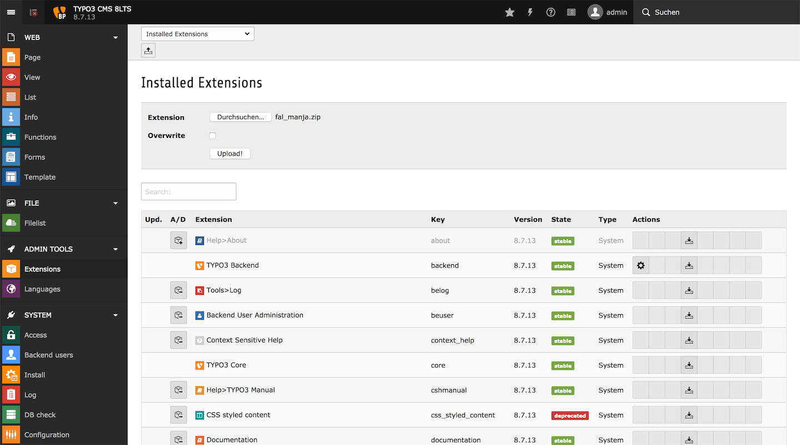
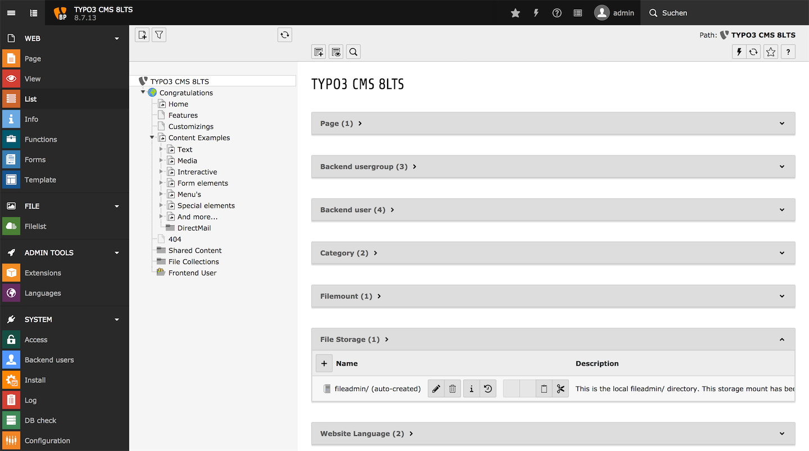

# Manja Digital Asset Management driver for TYPO3 File Abstraction Layer

This extension provides the necessary interfaces to connect a TYPO3 instance to Manja Digital Asset Management

Includes Manja API 4.0

## Requirements

TYPO3 CMS 7LTS, 8LTS & 9LTS

## License

This TYPO3 extension is licensed under GPL version 3 or any later version.

## Installation

### Install via ExtensionManager

Extract ZIP file as `fal_manja` to your local extension folder `typo3conf/ext` and install via ExtensionManager.  
Or upload via ExtensionManager, which installs automaticly.

  
_Install via ExtensionManager_

### Install via Composer

If extension will be available at [packagist](https://packagist.org/packages/jokumer/fal-manja) you can require it via composer

`composer require jokumer/fal-manja`

### Add file storage

To connect Manja Digital Asset Management with TYPO3 you need to create a new file storage at root level.

  
_Add new file storage_

Name your new file storage and select `Manja Digital Asset Management` as driver, which will open further fields to setup your file storage.

  
_Add file storage driver_

Setup your file storage with given credientlials in first tab `General` for at least `host`, `port`, `username`, `password`, `client id` and `tree id`.

Settings for `timeout`, `stream timeout`, `use SSL`, and `use session` has default values, which can be modified.

Checkbox for `Is default storage` is not enabled by default.  
Normally folder `fileadmin` is auto created and the default storage.

Checkbox for `Automaticly extract metadata after upload` is enabled by default.

Enter `Folder for manipulated and temporary images etc.` with `0:/typo3temp/assets/_processed_` for temporary folder of processed files.  
Any file from Manja server which is used in any modified versions (croped, resized, etc.) will be stored automaticly by TYPO3 in this folder. 

  
_Add file storage settings_

Checkbox for `is writable` in tab `Access capabilities` has no effect, cause this file storage driver does not support modification of files at Manja server via TYPO3 backend.

### Add file mount and access for editors

For backend editors (if you have) you usually need to add file mounts to get access to such folders inside your file storage.  
Therefore you should create a new file mount entry in your TYPO3 root level.

  
_Add new file mount_

Enter a label name and select your newly created file storage from the list.

  
_Add file mount driver_

Add settings for file mount and select a folder which exists at Manja server, to grant access for editors. The first entry `/` is for root level and all its subfolders.

  
_Add file mount settings_

Add your newly created file mount to backend editors access settings, which can be edited for each editor separately or by its group at root level.

  
_Add file mount to editors_

## Access files and folder at Manja server

In TYPO3 backend modul `Filelist` editors have access to all file mounts and its subfolders, which are configurated.

First time you select folders from Manja server, it will take extra time to load images from server and generate thumbnails for preview in TYPO3 backend, if you have choosen to show thumbnails in your profile.

  
_Backend modul file list_

Such files and folders can be reached also in `Filebrowser`, which comes up, if editors want to add or select media files to any content element.

Files and folders from Manja Server are readable only and not editable via TYPO3 - therefore all folders has a locked symbol.

The search in `Filelist` and `Filebrowser` searches for file name only per default in TYPO3. To search and sort by further informations you need a thirdparty extension for your TYPO3 installation. 

## Development

### Manja Digital Asset Management

IT-Service Robert Frunzke [www.manjadigital.de](https://www.manjadigital.de)

### Developers

Falk Röder mail@falk-roeder.de  
Jörg Kummer service@enobe.de

### Git repository

Private repository at [gitlab](https://manjagit.virtomain.de/manja/Add-On_Typo3) during development.  
A public repository is planned by manjadigital.
